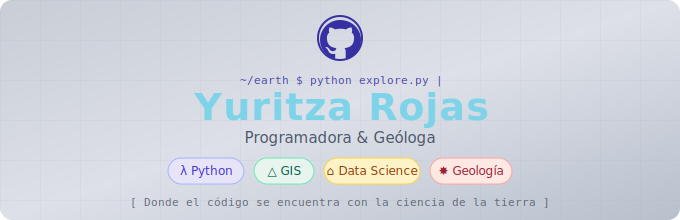

<h1 align="center">
  <b>¡Hola! Soy Yuritza Juliana Rojas Mantilla</b>
  
</h1>
<p align="center">
  
</p>
<p align="center">
  <a href="https://github.com/DenverCoder1/readme-typing-svg">
    
  </a>
</p>

## SOBRE MI

Soy estudiante de **Geología** en la Universidad Industrial de Santander (UIS) y de **Desarrollo de Software** en Campuslands, con *22* años y una gran pasión por el punto donde la ciencia de la Tierra y la programación se encuentran. Me fascina cómo el código puede ayudarnos a entender mejor nuestro planeta: desde el análisis de datos sísmicos hasta la visualización de estructuras geológicas en Google Earth Engine.

- 🪨 Estudiante de Geología — UIS, Bucaramanga
- 💻 Estudiante de Desarrollo de Software — Campuslands
- 🌐 Me interesa la intersección entre **geociencias y tecnología**
- 🔭 Explorando cómo la programación puede potenciar la ciencia
- 📍 Bucaramanga, Colombia

<br>

```python
class YuritzaRojas():

  def __init__(self):
    self.name       = "Yuritza Juliana Rojas Mantilla"
    self.username   = "yuritrojasmantilla"
    self.location   = "Bucaramanga, Colombia"
    self.education  = ["Geología - UIS", "Desarrollo de Software - Campuslands"]
    self.age        = 22
    self.interests  = ["Geociencias", "Programación", "Ciencia de datos"]
    self.motto      = "Las rocas guardan la historia del planeta; el código, la del futuro."

  def __str__(self):
    return self.name

if __name__ == '__main__':
    me = YuritzaRojas()
```

<br>


<br>

## HABILIDADES

<p align="center">

**Lenguajes con los que ya trabajo:**


<br>

**Control de versiones:**


<br>

**Próximamente — en mi horizonte de aprendizaje:**


<br>

**Herramientas y entornos:**


</p>

<br>


<br>

## CONTACTAME

<br>

<div align="center">

<a href="mailto:yuritrojasmantilla@gmail.com">
  
</a>
&nbsp;
<a href="https://www.linkedin.com/in/yuritza-j-rojas-m-1580b4245"/>
  
</a>
&nbsp;
<a href="https://www.instagram.com/__yuritrm/">
  
</a>
&nbsp;
<a href="https://discord.com/users/rm22dorot_38306">
  
</a>

</div>
<br>

## *"Aprende a serpentear: utiliza las irregularidades y obstáculos del terreno como puntos de apoyo para avanzar"* 🐍

<p align="center">
  
</p>


<br>

<div align="center">
  <i>✨ "Las rocas guardan millones de años de historia; el código, las posibilidades del mañana." ✨</i>
</div>

<br><br>

---

<div align="center">
  <sub>Hecho con 🪨 y 💻 desde Bucaramanga, Colombia</sub>
</div>
